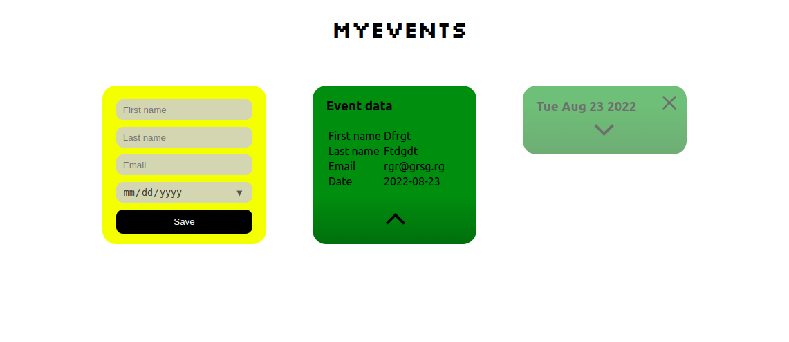

# MYEVENTS a.k.a. event-creator

Demo: http://event-creator.nkvch.me/

## Prerequisites

For app to run and connect to MongoDB you need to set environment variable `DB_CONNECTION_STRING` which is your mongo connection string. The mongo database should have created collection named `events`.

## Install

Run:

`git clone https://github.com/nkvch/event_creator`

In project folder:

`cd client`

`npm i`

`npm run build`

`cd ..`

`npm i`

`npm run build`

## Run

`npm start`

## Test

### Backend

`npm run test`

### Frontend

`cd client && npm run test`
